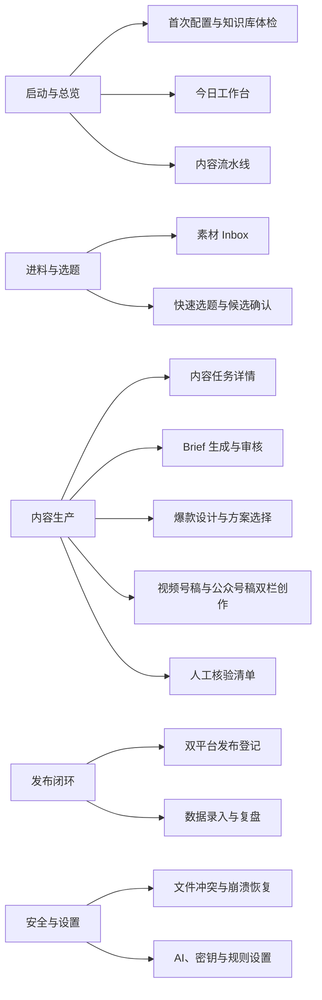

# 内容生产驾驶舱 MVP UX/UI 设计与评审

> 本轮只完成 MVP 功能页面、页面状态、三条交互链与 UX/UI 评审，不写插件工程代码。产品方向已经确认；波哥已于 2026-08-14 验收本方案，可以进入工程架构评审。

## 一、结论

本轮建议采用一套 **Obsidian 原生、紧凑、可解释、强人工关卡** 的桌面插件界面。

第一眼记忆点只有一个：

> 打开插件就知道今天下一步做什么，而且 AI 永远不能替我完成审核和发布确认。

本轮已形成以下设计资产：

1. 14 个 MVP 功能页面。
2. 13 种可切换页面状态（含正常状态）。
3. 3 条完整交互演示链，共 20 个步骤。
4. AI 动作、人工动作、文件写入和恢复动作的视觉规则。
5. 桌面宽屏、Obsidian 窄分栏和窄窗口的响应规则。
6. 一轮七维 UX/UI 评审与修订。

当前状态为 `approved`。下一步进入工程架构评审，但仍不能跳过元数据兼容性 ADR，也不能直接开始编码。

## 二、设计方向

### 2.1 产品类型

- 产品：知识库驱动的视频号与公众号内容生产驾驶舱。
- 用户：第一阶段只服务波哥本人。
- 载体：桌面端定制 Obsidian 插件。
- 核心任务：把素材安全推进到选题、生产、核验、发布和复盘。
- 数据事实：Vault 内 Markdown/YAML 是唯一业务事实来源。

### 2.2 视觉与交互原则

| 维度  | 采用方案                              | 理由                      |
| --- | --------------------------------- | ----------------------- |
| 美学  | 工业化、工具化、克制                        | 内容生产是高频工作，不做品牌展示页       |
| 布局  | 左侧分组导航 + 中央工作区 + 必要时的上下文侧栏        | 符合 Obsidian 桌面操作习惯      |
| 密度  | 紧凑但不拥挤                            | 允许扫描多条任务，不牺牲正文可读性       |
| 颜色  | 中性表面 + 单一主题强调色 + 语义色              | 颜色只表达动作和风险，不装饰          |
| 卡片  | 只有“卡片本身就是交互对象”时使用                 | 避免后台卡片墙和 AI 模板感         |
| 动效  | 只做功能动效                            | 生成进度、状态变化、恢复提示需要动效；其他不做 |
| 字体  | 实现时继承 Obsidian 主题字体；正文阅读区不低于 16px | 保持主题兼容和长文可读性            |

### 2.3 设计 Token

实现时优先使用 Obsidian CSS 变量，禁止把原型颜色硬编码为插件唯一主题。

| Token | 原型值 | 插件实现规则 |
|---|---:|---|
| 背景 | `#16181c` | `--background-primary` |
| 导航背景 | `#1b1e23` | `--background-secondary` |
| 面板 | `#20242a` | `--background-primary-alt` |
| 边线 | `#383f49` | `--background-modifier-border` |
| 正文 | `#eef1f4` | `--text-normal` |
| 次要文字 | `#a9b0ba` | `--text-muted` |
| 主题动作 | `#5aa6a8` | `--interactive-accent` |
| 人工关卡 | `#d7a84f` | 单独语义 Token，不使用主题色替代 |
| 成功 | `#67b987` | `--text-success` 或插件语义 Token |
| 错误 | `#dc7171` | `--text-error` |
| 圆角 | 4 / 7 / 10px | 小控件 / 面板 / 浮层分级，不统一大圆角 |
| 间距 | 4px 基础单位 | 4 / 8 / 12 / 16 / 24 / 32 |

## 三、信息架构



设计约束：

- 默认入口始终是“今日工作台”。
- 首次配置完成后，“首次配置与体检”不再占用日常首要位置；保留为“知识库体检”，可从设置或导航进入。
- 一级导航按工作阶段分成 5 组，不能把 14 个入口铺成一条无分组列表。
- 工作台只显示“最重要任务、排序原因、唯一下一步、任务资产”，完整统计进入二级页面。
- 内容生产页面必须显示当前阶段、前置关卡和退出条件。

## 四、14 个 MVP 页面规格

|   # | 页面          | 第一视觉焦点                 | 核心动作          | AI / 人工边界          | 退出条件                                           |
| --: | ----------- | ---------------------- | ------------- | ------------------ | ---------------------------------------------- |
|   1 | 首次配置与知识库体检  | 通过项、待确认项和安全承诺          | 选择 3 条试点并确认映射 | AI 只报告；映射由人确认      | Vault、Guide、Schema、SecretStorage、恢复目录可用，试点映射确认 |
|   2 | 今日工作台       | 今天最该处理的任务              | 执行唯一下一步       | 自动排序可解释；审核必须人工     | 当前任务完成或明确阻塞                                    |
|   3 | 内容流水线       | 各阶段任务与阻塞               | 打开某任务         | AI 不自动拖动任务阶段       | 进入任务详情或完成筛选                                    |
|   4 | 素材 Inbox    | 尚未处理的新素材               | 选择素材并快速选题     | 没有新素材时不得改用库内旧素材    | 至少选择 1 份真实素材                                   |
|   5 | 快速选题与候选确认   | 候选角度、证据锚点、风险           | 确认一个角度        | AI 推荐；人工决定是否生产     | 创建内容任务并关联来源                                    |
|   6 | 内容任务详情      | 当前阶段与唯一下一步             | 打开下一关         | 任务卡只聚合，不复制正文       | 进入对应资产或关卡                                      |
|   7 | Brief 生成与审核 | 核心观点、证据和事实边界           | 批准 Brief      | AI 生成预览；人工绑定哈希批准   | 必填项齐全且人工通过                                     |
|   8 | 爆款设计与方案选择   | 3 套方案的 Hook、标题、情绪曲线和风险 | 选择方案          | AI 生成方案；人工拍板       | Hook、标题、结构和平台差异确定                              |
|   9 | 双栏创作        | 两个平台的独立稿件与状态           | 修改或接受所选稿件     | AI 可修改；正式保存前展示预览   | 未跳过的平台稿件可追溯                                    |
|  10 | 人工核验清单      | 双平台各自的核验项和哈希           | 分别放行平台稿件      | AI 只能辅助找问题         | 每个平台检查完成并绑定当前哈希                                |
|  11 | 双平台发布登记     | 两个平台的真实发布事实            | 登记日期和链接，或人工跳过 | AI 不判断“已发布”        | 两平台分别 published 或一方明确 skipped                  |
|  12 | 数据录入与复盘     | 真实数据、未采集项、观察/推断/实验     | 确认复盘          | AI 草拟；用户确认数据和推断    | 复盘完成，归档与轻量提取满足                                 |
|  13 | 文件冲突与崩溃恢复   | 冲突文件、旧/新/当前哈希和安全推荐     | 比较、合并、继续或回滚   | 第三种哈希永不自动处理        | 文件状态可确定并重新验证                                   |
|  14 | AI、密钥与规则设置  | 连接状态、发送范围、人工关卡         | 验证密钥并保存       | 密钥只存 SecretStorage | 设置验证通过且未写入 Vault                               |

## 五、页面状态设计

### 5.1 全局状态合同

| 状态 | 用户看到什么 | 允许动作 | 文件与阶段行为 |
|---|---|---|---|
| 正常 | 当前页面主要任务与下一步 | 正常操作 | 按关卡规则执行 |
| 首次使用 | 一句话解释页面作用 + 一个开始动作 | 开始或跳过说明 | 不强制导览，不写业务状态 |
| 空数据 | 为什么为空、如何产生第一条数据 | 唯一主动作 | 不创建假数据或空壳文件 |
| 加载中 | 页面骨架和明确加载对象 | 取消或等待 | 不显示旧数据为新数据 |
| AI 生成中 | 当前步骤、输入范围、可取消说明 | 取消 | 只在预览/缓冲区，不推进阶段 |
| AI 调用失败 | 错误类别、重试、人工编辑 | 重试、查看错误、人工继续 | 正式文件不变，重试幂等 |
| 文件缺失 | 缺失路径和受影响资产 | 重新定位、恢复、解除关联 | 阻塞推进，不创建空壳替代 |
| 文件被外部修改 | 三方差异入口和停止原因 | 比较、合并、恢复 | 禁止静默覆盖 |
| 审核失效 | 旧审核哈希与当前哈希不一致 | 查看修改、重新核验 | 旧记录保留，当前放行失效 |
| 权限或密钥错误 | 缺密钥、无权限、余额不足或限流的具体类别 | 打开设置、验证连接 | 禁用 AI 动作，人工工作不受影响 |
| 操作成功 | 已写入、已重读、已验证 | 继续下一关 | 成功后才更新 revision 和阶段 |
| 部分完成 | 已完成项与未完成项分别显示 | 继续未完成项 | 不把单平台完成伪装成双平台完成 |
| 需要人工确认 | 决策内容、影响、确认后发生什么 | 返回检查、明确确认 | 记录审核人、时间、哈希和清单版本 |

### 5.2 每页必须定制的状态文案

| 页面 | 空数据主动作 | 最重要失败状态 | 必须人工确认的动作 |
|---|---|---|---|
| 配置体检 | 开始首次体检 | Schema 缺项或恢复目录不可用 | 试点资产映射 |
| 今日工作台 | 查看 Inbox 或从库内选题 | 排序依据缺失 / 任务状态不一致 | 无，直接进入对应关卡 |
| 内容流水线 | 创建第一条任务 | 阶段与资产状态冲突 | 修复任务状态的选择 |
| 素材 Inbox | 打开 Inbox 目录 | 文件读取失败 | 选择素材进入快速通道 |
| 快速选题 | 返回选择素材 | AI 生成失败 / 证据不足 | 确认选题进入生产 |
| 任务详情 | 返回流水线 | 关联文件缺失 | 解除错误关联 |
| Brief | 先生成 Brief | 来源缺失 / 审核失效 | 批准当前哈希版本 |
| 爆款设计 | 生成 3 套方案 | 方案结构不完整 | 选择最终方案 |
| 双栏创作 | 生成未跳过平台稿件 | 单稿成功、单稿失败 | 接受 AI 修改或跳过平台 |
| 人工核验 | 先完成稿件 | 文件外部修改 / 审核失效 | 各平台独立放行 |
| 发布登记 | 查看 ready 稿件 | 真实发布信息不完整 | 确认 published 或 skipped |
| 数据复盘 | 查看已发布内容 | 数据来源缺失 | 确认复盘和实验结论 |
| 冲突恢复 | 显示“当前无恢复任务” | 第三种哈希 / 无有效日志 | 保留、合并、继续或回滚 |
| 设置 | 开始连接 AI | 密钥、权限、余额、限流 | 保存发送范围与人工关卡规则 |

## 六、三条完整交互链

### 6.1 新素材快速生产链

```text
素材 Inbox（选择 2 份）
→ AI 生成快速选题候选
→ 人工确认 1 个角度
→ Brief 生成与人工审核
→ 爆款方案比较与人工选择
→ 视频号稿 + 公众号稿双栏创作
→ 两个平台分别人工核验
```

原型共 7 步。快速通道只压缩进料和选题时间，不跳过 Brief、爆款设计、双稿或核验。

### 6.2 库内素材常规闭环

```text
库内未用素材生成常规候选
→ 创建任务卡并确认关联
→ Brief
→ 爆款设计
→ 双稿创作
→ 双平台核验
→ 双平台独立发布登记
→ 数据录入与复盘
```

原型共 8 步。任一平台未发布时，任务继续停留在 `publishing`；数据缺失保持“未采集”。

### 6.3 中断与冲突恢复链

```text
AI 已返回并准备写入
→ 发现文件出现第三种哈希
→ 自动停止并打开恢复页面
→ 人工比较旧快照、AI 版本、外部版本
→ 选择保留 / 合并 / 回滚
→ 重读验证
→ 回到未完成的创作页面
```

原型共 5 个界面步骤。恢复链结束后必须回到原任务上下文，不能把用户丢在一个孤立日志页面。

## 七、两次点击预算

“两次点击内完成”用于关键入口，不等于所有复杂任务都强行压缩成两次点击。

| 用户目标 | 第 1 次 | 第 2 次 | 结论 |
|---|---|---|---|
| 继续今天最重要任务 | 打开插件即看到 | 点击唯一主动作 | 1 次 |
| 用新素材快速选题 | 点击“素材 Inbox”或首页“快速选题” | 选择后点击生成 | 2 次 |
| 打开某条任务 | 点击流水线 | 点击任务 | 2 次 |
| 对稿件人工核验 | 首页点击“打开核验清单” | 勾选并确认 | 2 次进入关卡；核验本身不计为导航点击 |
| AI 修改稿件 | 任务或双栏页 | 点击“AI 修改所选稿件” | 1–2 次 |
| 冲突恢复 | 顶部阻塞提示 | 点击“进入恢复” | 1 次 |

## 八、AI 与人工动作的区分

界面不能只用颜色区分，必须同时使用文字、位置和确认行为：

| 类型 | 标签 | 按钮行为 | 能否推进关卡 |
|---|---|---|---|
| AI 动作 | `[AI] 生成 / 检查 / 修改` | 直接启动，可取消；结果进入预览 | 不能直接推进人工关卡 |
| 人工动作 | `[人工关卡] 确认 / 批准 / 放行 / 已发布` | 打开确认层，说明影响 | 明确确认且写入验证成功后才能推进 |
| 普通导航 | `打开 / 查看 / 返回` | 不改变业务事实 | 不能 |
| 恢复动作 | `比较 / 合并 / 回滚 / 继续` | 展示文件与哈希影响 | 仅在可确定、可验证时改变状态 |

硬规则：AI 永远不能显示“我已替你审核通过”“我确认已经发布”或“我判断可以回滚”。

## 九、双平台独立状态

双栏创作、人工核验、发布登记和复盘都必须始终显示两条独立状态：

```text
视频号：not_started → draft → review → ready → published / skipped
公众号：not_started → draft → review → ready → published / skipped
```

页面上必须同时显示：

- 平台名称。
- 当前状态文字。
- 当前文件版本或哈希。
- 该平台下一步。
- 另一平台未完成时，任务为什么不能进入复盘。

禁止只显示一个合并的 `published` 状态。

## 十、响应式与可访问性

第一阶段仍是桌面插件，但 Obsidian 工作区经常被拖成窄分栏，因此必须支持三档：

| 宽度 | 行为 |
|---|---|
| ≥ 1100px | 完整左侧导航；双栏编辑器同时显示；上下文侧栏并列 |
| 760–1099px | 缩窄导航；上下文侧栏移到正文下方；指标从 4 列变 2 列 |
| < 760px | 导航变为横向可滚动；双稿切为平台标签；表单单列；恢复表隐藏次要哈希列 |

无障碍要求：

- 所有核心动作可使用键盘完成。
- 候选选题使用单选语义，素材选择使用可选列表语义。
- 焦点状态清晰，浮层打开后焦点进入浮层，Esc 可关闭。
- 状态不只依赖红、绿、黄颜色，必须有文字标签。
- 正文阅读区不低于 16px；说明性标签可使用 11–13px，但必须达到对比度要求。
- 交互目标桌面最小 34px；未来若支持触控则提升到 44px。

## 十一、UX/UI 评审

### 11.1 七维评分

| 评审维度 | 原方案 | 修订后 | 主要修订 |
|---|---:|---:|---|
| 信息架构 | 6/10 | 9/10 | 14 页按 5 个阶段分组，默认工作台，体检完成后降级为辅助入口 |
| 交互状态 | 2/10 | 9/10 | 建立 13 种状态合同与每页定制文案 |
| 用户旅程 | 4/10 | 9/10 | 跑通新素材、库内素材、冲突恢复三条链 |
| AI 模板感风险 | 5/10 | 9/10 | 使用主工作区、列表和必要卡片，避免 KPI 卡片墙、渐变按钮和装饰图标 |
| 设计系统 | 2/10 | 8/10 | 建立 Token、动作层级、排版、间距和 Obsidian 主题继承规则 |
| 响应式与无障碍 | 2/10 | 8/10 | 增加三档布局、窄栏双稿切换、键盘选择和焦点规则 |
| 未决策事项 | 4/10 | 8/10 | 产品级 UX 无 P0；保留用户视觉验收和工程实现验证 |
| **整体** | **4/10** | **8.6/10** | 达到可交付评审程度，尚未达到可直接开发状态 |

### 11.2 用户指定的六项验收

| 验收问题 | 结论 | 证据 |
|---|---|---|
| 打开插件后是否知道下一步 | 通过 | 今日工作台第一视觉焦点为唯一下一步和排序原因 |
| 关键操作是否两次点击内完成 | 通过 | 见“两次点击预算”；复杂审核步骤不被错误压缩 |
| 人工审核和 AI 动作是否容易混淆 | 通过 | 标签、动词、颜色、确认层与状态推进权限同时区分 |
| 页面是否信息过载 | 有条件通过 | 工作台已收敛；流水线允许横向浏览；14 页已分成 5 组 |
| 视频号与公众号独立状态是否清楚 | 通过 | 双栏创作、核验、发布和复盘均分平台显示 |
| 错误发生后是否知道怎么恢复 | 通过 | 状态提示包含停止原因、推荐动作、差异入口与恢复边界 |

### 11.3 评审中发现并已修正的问题

1. **页头主动作不能只是装饰。** 已为页头动作补充原型行为：生成进入 AI 生成状态，人工动作打开确认层，设置保存进入成功状态。
2. **双栏编辑在窄窗口不可用。** 已增加视频号 / 公众号标签切换。
3. **候选角度和素材选择只支持鼠标。** 已增加键盘焦点、Enter / Space 选择和单选 / 可选语义。
4. **产品方案过早宣布进入工程评审。** 本轮将其修正为：产品方向通过，UX/UI 等待用户验收，工程评审阻塞。

### 11.4 仍需现实验证的风险

- 当前是已验收的功能原型，不是运行在 Obsidian 容器中的真实插件；主题兼容必须在工程阶段用明暗主题验证。
- 当前环境的浏览器安全策略不允许自动打开本地 `file://` 原型，因此本轮完成了静态结构、脚本语法、页面/状态/链路引用验证，但不能声称已经完成自动截图视觉回归。
- 正式 `Metadata Schema.md` 仍未登记 `script`、`viral-design` 和 `content-task`。这不是 UI 可以绕过的问题，必须在工程前 ADR 中解决。

## 十二、NOT in scope

- 独立软件、Web SaaS 或手机 App。
- 自动发布视频号或公众号。
- 团队、角色、权限与多人协作。
- 移动端完整写作，只保证窄分栏可用。
- 多模型市场和通用聊天窗口。
- 在本轮修改正式元数据 Schema、迁移旧资产或写插件代码。
- 最终品牌名称、Logo 和市场视觉。

## 十三、已复用的现有资产

- `96-System/Guides/Content Production Workflow.md`：关卡和退出条件。
- `96-System/Config/Metadata Schema.md`：当前正式字段与已知缺口。
- `2026-08-14 知识库驱动内容生产驾驶舱-产品设计方案.md`：产品、状态机、恢复协议和 MVP 边界。
- `2026-08-14 内容生产驾驶舱-首页线框.png`：工作台第一版信息层级。
- 现有 Brief、爆款设计、视频号稿和公众号稿：原型中的真实内容结构来源。

## 十四、用户验收方法

打开 `2026-08-14 内容生产驾驶舱-MVP功能原型.html` 后，按以下顺序验收：

1. 默认首页是否在 5 秒内告诉你今天最该做什么。
2. 用右上角“演示三条链”依次走完 3 条流程。
3. 在任意核心页面使用“状态实验台”切换全部异常状态。
4. 重点检查快速选题、双栏创作、人工核验和冲突恢复 4 个页面。
5. 记录不满意的地方时，按“页面 + 状态 + 你原本想做的动作 + 哪里不顺”描述。

以下验收条件已于 2026-08-14 由波哥确认通过：

- 14 页范围无遗漏。
- 三条链没有断点。
- 人工与 AI 动作不会混淆。
- 双平台状态清楚。
- 错误恢复路径可理解。
- 波哥明确确认“原型设计通过”。

## 十五、后续实施任务

- [x] **T1（P1）— 波哥完成 MVP 功能原型验收**
  - 来源：本轮唯一未关闭的产品门槛。
  - 文件：本方案与 MVP 功能原型。
  - 验证：逐条完成“用户验收方法”并记录结论。
- [ ] **T2（P1）— 在工程前 ADR 中登记 `script`、`viral-design`、`content-task`**
  - 来源：元数据规范与实际内容类型不一致。
  - 文件：`96-System/Config/Metadata Schema.md` 与新 ADR。
  - 验证：试点任务可以无歧义地读取类型和状态。
- [ ] **T3（P1）— UX/UI 通过后执行工程架构评审**
  - 来源：多文件写入、哈希审核、SecretStorage 和恢复协议必须落到接口与测试。
  - 文件：届时确定的插件工程目录。
  - 验证：工程评审覆盖六个纵向切片和逐崩溃点测试。
- [ ] **T4（P2）— 在真实 Obsidian 明暗主题和窄分栏中做设计 QA**
  - 来源：当前原型不能代替真实容器验证。
  - 文件：插件 CSS 与视图组件。
  - 验证：明暗主题、760px / 1100px 分界、键盘焦点、长标题和空数据状态。

## GSTACK REVIEW REPORT

| Review | Trigger | Why | Runs | Status | Findings |
|---|---|---|---:|---|---|
| CEO Review | `office-hours` / 产品冷评 | 产品范围与载体 | 3 | CLEAR | 产品方向、载体、数据边界和人工关卡已确认 |
| Codex Review | 本轮静态验证 | 页面、状态与链路引用 | 1 | CLEAR | 14 页、13 状态、3 条链；脚本语法通过，0 个断链引用 |
| Eng Review | `/plan-eng-review` | 架构与测试 | 0 | READY TO RUN | UX/UI 已验收；评审中必须处理元数据 ADR、文件恢复和测试矩阵 |
| Design Review | `/plan-design-review` | UI/UX 缺口 | 1 | CLEAR | 4/10 → 8.6/10；4 项已修正；用户已验收原型 |
| DX Review | `/plan-devex-review` | 开发者体验 | 0 | NOT RUN | 工程目录尚未锁定，本轮不适用 |

**VERDICT:** 产品方向与 MVP UX/UI 均已通过；可以进入工程架构评审，但不能直接编码。

NO UNRESOLVED DECISIONS
